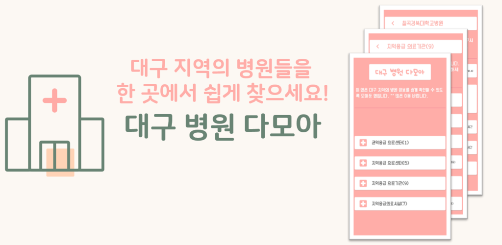

# 대구 병원 다모아

대구시 내 병원 22곳에 대한 정보를 한눈에 확인할 수 있도록 하는 앱입니다. 아주 기본적인 내용만 공부해서 만들어 본 앱입니다. 또한 출시를 시도한 생애 첫 모바일 앱이기도 합니다.

개발 시작 : 2020.04.21 ~

## App Icon

현재 구글 플레이 스토어에 출시했고, 출시 검토를 받고 있는 중입니다.

## 실행화면

## 기능
- 대구시 내 병원 22곳에 대한 정보를 '권역응급 의료센터', '지역응급 의료센터', '지역응급 의료기관', '지역응급의료시설'로 분류하여 보여줍니다.
- 대구시 내 병원 22곳의 홈페이지, 전화번호, 접수/진료 시간을 안내합니다.
- 홈페이지 정보 클릭 시 해당 병원의 홈페이지로 바로 이동합니다.
- 전화번호 클릭 시 전화 거는 화면으로 바로 이동합니다.

## Release
***1.0.0 릴리즈**
- 대구시 내 병원 22곳에 대한 정보(홈페이지, 전화번호, 접수/진료 시간 등)를 한눈에 확인할 수 있습니다.
- 많은 이용 바랍니다^^

